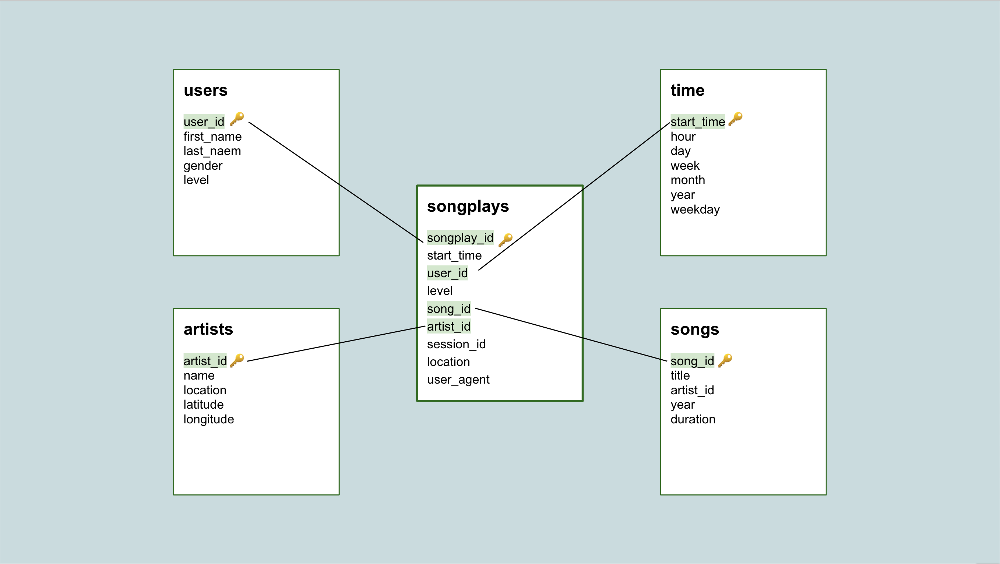

# Project 3: Data Warehouse with AWS Redshift and S3
--------------
## 1. Aim of the project

The goal of this project is to build an ETL pipeline that extracts a music streaming startup, Sparkify's data from S3, stages it in Redshift, and transforms it into a set of dimensional tables. The data resides in S3 in a directory of JSON logs on user activity on the app. 

This process will be done for their analytics team to find insights in what songs their users are listening to. 
In order to complete this project, it will be needed to load data from S3 to staging tables on Redshift and execute SQL statements that create the analytics tables from these staging tables.

## 2. Dataset for the project
Two datasets are used for this project and they reside in S3. 
Here are the S3 links for each dataset:

**1. Song data: s3://udacity-dend/song_data**  
Each file of this dataset is in JSON format. It contains the data about a song and the artist of that song. 

**2. Log data: s3://udacity-dend/log_data**  
This dataset consists of log files in JSON format generated by an event simulator based on the songs in the above dataset.The log files are partitioned by year and month.

The contents of these data will be copyed by `COPY` command to the stagin tables in the Redshift. 

## 3. Database Schema Design

I created the following five tables to achive the project goal.  The queries making data schema are written in `sql_queries2.py`:  

### Fact Table

**1. songplays - records in event data associated with song plays (records with page `NextSong`)**

*songplay_id (Primary_key),  
start_time,  
user_id,  
level,  
song_id,  
artist_id,  
session_id,  
location,  
user_agent*  

### Dimension Tables
**2. users - users in the app**  
*user_id (Primary_key),  
first_name,  
last_name,  
gender,  
level*

**3. songs - songs in music database**  
*song_id (Primary_key),  
title,  
artist_id,  
year,  
duration*

**4. artists - artists in music database**  
*artist_id (Primary_key),  
name,  
location,  
lattitude,  
longitude*

**5. time - timestamps of records in songplays broken down into specific units**
*start_time (Primary_key),
hour,  
day,  
week,  
month,  
year,  
weekday*

 
## 4. Steps to build ETL pipeline and complete creating schema 

1. Run `create_tables.py` to drop and create tables.  This script connects to database, drops existing tables and create tables in the Redshift cluster.
2. Run `etl.py` to load data from S3 to staging tables on Redshift and transform it into the fact and dimension tables.

